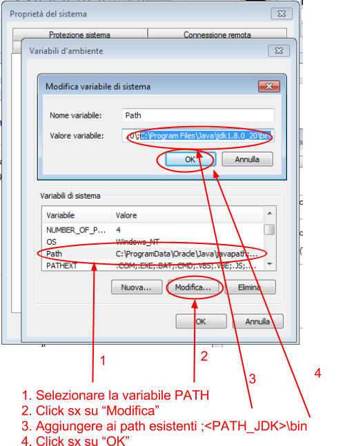
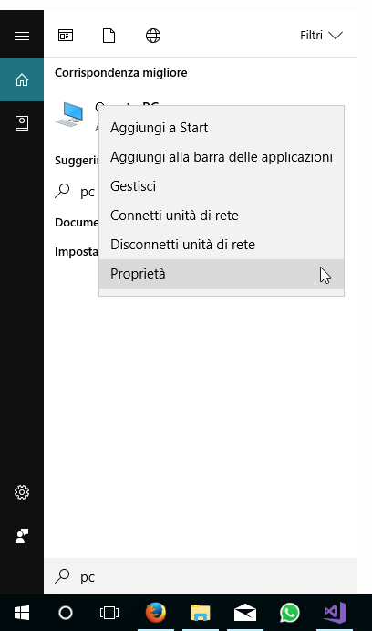
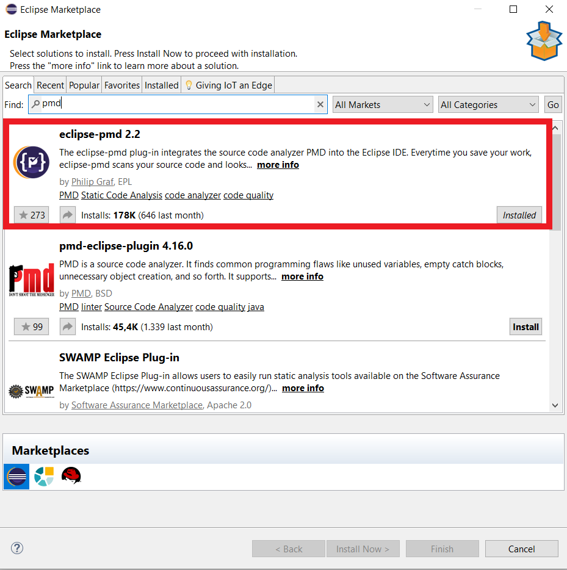

Il seguente documento fornisce le istruzioni necessarie per installare gli strumenti di sviluppo utilizzati nel contesto del corso di Programmazione ad Oggetti.
La guida presenta le procedure di installazione e configurazione su Linux (varie distribuzioni), MacOS X e Windows del **Java Development Kit** (JDK) e dell'ambiente di sviluppo integrato **Eclipse**.


# Java Development Kit (JDK)

Il JDK è l'insieme degli strumenti necessari a sviluppare software standard in Java.
Include la virtual machine Java, le librerie Java, di base, il compilatore, e i tool di contorno.

Esistono varie versioni del JDK, quella di riferimento è OpenJDK, a partire dalla quale ne vengono sviluppate altre soa gratuite che a pagamento (fra cui [Oracle JDK](https://www.oracle.com/technetwork/java/javase/downloads/index.html), [Eclipse OpenJ9](https://www.eclipse.org/openj9/), [Amazon Corretto](https://aws.amazon.com/corretto/), [GraalVM](https://www.graalvm.org/), [Bellsoft Liberica JDK](https://bell-sw.com/), [Azul Zulu](https://www.azul.com/downloads/zulu-community/?&show-old-builds=true)...).

A sua volta, OpenJDK è distribuito in forma di sorgente, e vari distributori ne forniscono versioni binarie.
Fra questi, [AdoptOpenJDK](https://adoptopenjdk.net/).
La macchina virtuale Java di riferimento sarà OpenJDK 11 come fornita da AdoptOpenJDK.

Seguono le istruzioni di installazione e configuazione per i vari sistemi operativi.

## Installazione multipiattaforma via Jabba

Data la varietà di versioni, distribuzioni sorgenti, e distribuzioni binarie di JVM, esiste un tool Linux che consente di installare quella desiderata e cambiarla rapidamente.
Il tool è [Jabba](https://github.com/shyiko/jabba).

Per installare Jabba su Linux o Mac OS X, si lanci il seguente comando da terminale:


curl -sL https://github.com/shyiko/jabba/raw/master/install.sh | bash && . ~/.jabba/jabba.sh


Per installare Jabba su Windows 10, si lanci invece il seguente comando su Powershell:


[Net.ServicePointManager]::SecurityProtocol = [Net.SecurityProtocolType]::Tls12
Invoke-Expression (
  Invoke-WebRequest https://github.com/shyiko/jabba/raw/master/install.ps1 -UseBasicParsing
).Content


Una volta che Jabba è installato, può essere utilizzato per installare il JDK.
Si elenchino tutte le versioni di AdoptOpenJDK utilizzando

jabba ls-remote adopt@


Quindi si selezioni la più recente fra le versioni 11, ad esempio se l'output è:

```
adopt@1.12.33-0
adopt@1.12.0-2
adopt@1.12.0-1
adopt@1.11.28-0
adopt@1.11.0-4
adopt@1.11.0-3
adopt@1.11.0-2
adopt@1.11.0-1
adopt@1.10.0-2
adopt@1.9.181-0
adopt@1.9.0-4
adopt@1.8.222-10
adopt@1.8.212-04
adopt@1.8.212-03
adopt@1.8.202-08
adopt@1.8.192-12
adopt@1.8.181-13
adopt@1.8.172-11
```

Si scelga `adopt@1.11.28-0`.
A questo punto si installi utilizzando i seguenti comandi:


jabba install adopt@1.11.28-0
jabba use adopt@1.11.28-0


## Impostazione delle variabli d'ambiente

### Arch Linux e derivate

Operazione non necessaria.

### Ubuntu Linux e derivate (Mint)

**@Roby, ci pensi tu?**

### Mac OS X

**@Roby, ci pensi tu?**

### Windows

Jabba installa il JDK desiderato in una cartella dedicata nella user home dell'utente, ovvero: `%HOMEPATH%\.jabba\jdk\<version>` .
E' necessario quindi definire una variabile d'ambiente (`JAVA_HOME`) relativa a tale percorso ed includerla nel `Path` di sistema, come segue (si fa riferimento a Windows 10, per versioni precedenti la procedura è analoga).

1. Aprire il menù d'avvio e digitare __"Modifica variabili d'ambiente relative al sistema"__:


2. Si aprirà la finestra "Proprietà del sistema":


3. Cliccando poi sul pulsante __"Nuova"__ (_quello più in basso!_), si aprirà la finestra di dialogo __"Variabili d'ambiente"__, necessaria per creare una nuova variabile d'ambiente:


4. Creare la variabile denonimata __"JAVA_HOME"__ con valore `C:\Program Files\Java\jdk1.8.<minor_version>` e cliccare sul pulsante __"OK"__:

    - __Nota bene__: il percorso specifico del JDK potrebbe variare da quello qui descritto in caso di installazioni personalizzate.

5. Tornando alla schermata __"Variabili d'ambiente"__, modificare la variabile `Path` (_quella più in basso!_), cliccando sul pulsante __"Modifica"__.

6. Alla lista di percorsi che apparirà, aggingere la voce `%JAVA_HOME%\bin`:


7. Premere su __"OK"__ su tutte le finestre sin qui aperte per confermare le modifiche.

8. Fatto! Verificare la corretta installazione del JDK eseguendo __entrambi__ i comandi `javac -version` e `java -version` dal prompt dei comandi.

## Verifica del funzionamento

Al fine di testare l'esecuzione, si chiuda il terminale, si apra un nuovo terminale, e si eseguano i comandi:

java -version
javac -version

e si osservi il risultato. L'output atteso dovrà essere analogo a:

$ java -version
openjdk version "11" 2018-09-25
OpenJDK Runtime Environment AdoptOpenJDK (build 11+28)
OpenJDK 64-Bit Server VM AdoptOpenJDK (build 11+28, mixed mode)

$ javac -version
javac 11

Si noti, in particolare, la versione 11, ed il provider AdoptOpenJDK.

## Installazione alternativa su specifici OS

### Arch e derivate (Manjaro, Bridge…)
Arch offre il pacchetto OpenJDK 11 direttamente nel repository principale:

sudo pacman -S jdk11-openjdk

È possibile avere più ambienti Java installati contemporaneamente, si può selezionare quello corrente utilizzando il comando ``archlinux-java``.
Per assicurarsi di star lavorando con OpenJDK 11, si utilizzi:

sudo archlinux-java set java-11-openjdk


### Windows

**@Angelo, intervieni da qui, passa tutto ad AdoptOpenJDK**

Su Windows la procedura dipende dalla versione utilizzata.
In particolare, si differenzia fra Windows 7 (e precedenti), Windows 8 e Windows 10 a causa delle variazioni nell'interfaccia grafica.
Versioni inferiori a Windows Vista non sono supportate.

I passi in comune a tutte le versioni di Windows sono i seguenti:

1. Scaricare il JDK dalla [pagina di download ufficiale di Oracle][JDK download page].
Scegliere la versione 32/64 bit corrispondente alla propria versione del sistema operativo (p.e. Windows a 32 bit ---> JDK a 32 bit).


2. Eseguire l'installer scaricato e seguire il wizard di installazione passo-passo.

3. Configurazione delle variabili d'ambiente
    - Questa fase varia leggermente a seconda della versione di Windows. Le istruzioni specifiche di ogni versione sono riportate nel seguito.

4. Dopo aver configurato le variabili d'ambiente, aprire un prompt dei comandi per verificare l'esito positivo dello step precedente (è sufficente cercare `cmd.exe` nel menù di Start):


5. Verificare l'avvenuta installazione eseguendo i seguenti due comandi su un prompt dei comandi:
    
    javac -version  # Output atteso: 'javac 1.8.0_121'
    java -version   # Output atteso: 'java version "1.8.0_144" ...'
    


#### Impostazione variabili d'ambiente su Vista / 7

1. Aprire le proprietà di sistema:<br/>


2. Aprire la schermata relativa alle variabili di ambiente:<br/>


3. Configurare la variabile `JAVA_HOME` come mostrato:<br/>

    - Sostituire `<PATH_JDK>` con il percorso in cui si è installato il JDK (che, di solito, è `C:\Program Files\Java\jdk.1.8.<minor_version>`)

4. Modificare la  variabile d’ambiente `Path` aggiungendo al contenuto preesistente `;%JAVA_HOME%\bin` (*il punto-e-virgola è importante!*):<br/>


5. Verificare la corretta installazione del JDK eseguendo il comando `javac -version` e `java -version` dal prompt dei comandi.


#### Impostazione variabili d'ambiente su Windows 8

1. Aprire il menù d'avvio cercare il __"Pannello di controllo"__:


2. Cliccare sulla voce __"Sistema e sicurezza"__ del Pannello di controllo:


3. Appariranno una serie di voci. Selezionare __"Sistema"__:


4. Selezionare __"Impostazioni di sistema avanzate"__ tra le voci a sinistra:


5. Nella schermata __"Proprietà del sistema"__ che apparirà, cliccare sul pulsante __"Variabili d'ambiente"__:


6. Proseguire seguendo le istruzioni per Windows 7 partendo dal punto 3.

### Impostazione variabili d'ambiente su Windows 10

1. Aprire il menù d'avvio e digitare __"Modifica variabili d'ambiente relative al sistema"__:

    - In alternativa, dal menù d'avvio, cercare la voce __"Questo PC"__ e cliccare su di essa col pulsante destro. Dal menù a tendina che apparirà, selezionare la voce __"Proprietà"__:
    
    - Dalla schermata __"Sistema"__ che apparirà, selezionare la voce __"Impostazioni di sistema avanzate"__ (a sinistra):
    


2. Si aprirà la finestra "Proprietà del sistema":


3. Cliccando poi sul pulsante __"Nuova"__ (_quello più in basso!_), si aprirà la finestra di dialogo __"Variabili d'ambiente"__, necessaria per creare una nuova variabile d'ambiente:


4. Creare la variabile denonimata __"JAVA_HOME"__ con valore `C:\Program Files\Java\jdk1.8.<minor_version>` e cliccare sul pulsante __"OK"__:

    - __Nota bene__: il percorso specifico del JDK potrebbe variare da quello qui descritto in caso di installazioni personalizzate.

5. Tornando alla schermata __"Variabili d'ambiente"__, modificare la variabile `Path` (_quella più in basso!_), cliccando sul pulsante __"Modifica"__.

6. Alla lista di percorsi che apparirà, aggingere la voce `%JAVA_HOME%\bin`:


7. Premere su __"OK"__ su tutte le finestre sin qui aperte per confermare le modifiche.

8. Fatto! Verificare la corretta installazione del JDK eseguendo __entrambi__ i comandi `javac -version` e `java -version` dal prompt dei comandi.

**Fine intervento @Angelo**

# Eclipse

## Arch Linux e derivate (Manjaro, Antergos, Bridge...)
Arch manutiene nel repository ufficiale Eclipse all’ultima versione, sempre aggiornato. Gli utenti di Arch possono usare il package manager per installare Eclipse (``sudo pacman -S eclipse``), e saltare direttamente al punto 6, lanciando il comando ``eclipse``.

## Tutti i sistemi operativi

1. Scaricare “Eclipse IDE” (ultima versione disponibile) dalla [pagina di download ufficiale (qui)][Eclipse Download]. 
2. Seguire le istruzioni per l'installazione, selezionando "Eclipse IDE for Java Developers".
3. Si lanci l'IDE: se l’installazione è andata a buon fine si dovrebbe aprire la schermata di benvenuto dell'IDE.


# Plugin di Eclipse

Eclipse utilizza un'architettura a plug-in. Lungo il corso ne utilizzeremo alcuni che ci forniranno funzionalità aggiuntive.

## SpotBugs (precedentemente noto come FindBugs)
* In Eclipse, click Help -> Eclipse Marketplace...


* Nella barra di ricerca, inserire "spotbugs", quindi premere Invio
* Uno dei plugin trovati dovrebbe essere "SpotBugs Eclipse Plugin", si usi l'immagine seguente per verificare che corrisponda:


* clickare su `"Install Now >"`
* Seguire le istruzioni, accettare la licenza, attendere che Eclipse scarichi ed installi il prodotti, accettare l'installazione e riavviare l'IDE.

## PMD
* In Eclipse, click Help -> Eclipse Marketplace...


* Nella barra di ricerca, inserire "pmd", quindi premere Invio
* Appariranno più plugin, uno dei plugin trovati dovrebbe essere pmd-eclipse-plugin. *ATTENZIONE:* I diversi plugin PMD *confliggono fra loro*, installare solo quello suggerito. Lo si identifichi utilizzando l'immagine seguente:



* clickare su `"Install Now >"`
* Seguire le istruzioni, accettare la licenza, attendere che Eclipse scarichi ed installi il prodotti, accettare l'installazione e riavviare l'IDE.

## Checkstyle
* In Eclipse, click Help -> Eclipse Marketplace...


* Nella barra di ricerca, inserire "pmd", quindi premere Invio
* Appariranno più plugin, uno dei plugin trovati dovrebbe essere "Checkstyle Plug-in X.Y.Z" (con X.Y.Z numero di versione). Lo si identifichi utilizzando l'immagine seguente:


* clickare su `"Install Now >"`
* Seguire le istruzioni, accettare la licenza, attendere che Eclipse scarichi ed installi il prodotti, accettare l'installazione e riavviare l'IDE.


# Git

Git è un decentralized version control system (DVCS), che consente di tenere traccia della storia di un progetto, versionarla, tornare allo stato precedente, e lavorare in parallelo.

Al termine del processo di installazione, per verificarne la correttezza, è possibile eseguire da shell il comando: ``git``, accertandosi che l’output prodotto sia del tipo:


usage: git [--version] [--help] [-C <path>] [-c name=value]
           [--exec-path[=<path>]] [--html-path] [--man-path] [--info-path]
           [-p | --paginate | --no-pager] [--no-replace-objects] [--bare]
           [--git-dir=<path>] [--work-tree=<path>] [--namespace=<name>]
           <command> [<args>]

These are common Git commands used in various situations:

start a working area (see also: git help tutorial)
   clone      Clone a repository into a new directory
   init       Create an empty Git repository or reinitialize an existing one

work on the current change (see also: git help everyday)
   add        Add file contents to the index
   mv         Move or rename a file, a directory, or a symlink
   reset      Reset current HEAD to the specified state
   rm         Remove files from the working tree and from the index

examine the history and state (see also: git help revisions)
   bisect     Use binary search to find the commit that introduced a bug
   grep       Print lines matching a pattern
   log        Show commit logs
   show       Show various types of objects
   status     Show the working tree status

grow, mark and tweak your common history
   branch     List, create, or delete branches
   checkout   Switch branches or restore working tree files
   commit     Record changes to the repository
   diff       Show changes between commits, commit and working tree, etc
   merge      Join two or more development histories together
   rebase     Reapply commits on top of another base tip
   tag        Create, list, delete or verify a tag object signed with GPG

collaborate (see also: git help workflows)
   fetch      Download objects and refs from another repository
   pull       Fetch from and integrate with another repository or a local branch
   push       Update remote refs along with associated objects

'git help -a' and 'git help -g' list available subcommands and some
concept guides. See 'git help <command>' or 'git help <concept>'
to read about a specific subcommand or concept.



## Linux

Git è preinstallato in molte distribuzioni.
Si raccomanda quindi di testare se sia già presente eseguendo `git` su terminale prima di partire con l'eventuale installazione.
Se già presente, ovviamente, non occorre intraprendere alcuna azione.

Se non fosse installato, è di norma installabile dal package manager.
Le istruzioni per tutte le distribuzioni più comuni [sono disponibili qui](https://git-scm.com/download/linux).

## Windows
1. Scaricare “GIT for Windows” (nella versione specifica per la propria architettura x86 o x64) dalla [pagina di download ufficiale][GIT-Windows Download].
2. Eseguire il programma di installazione
    * Accettare la licenza > Next > Next
    * **IMPORTANTE:** Selezionare "Use Git from the Windows Command Prompt" > Next
    * Accettare le successive opzioni proposte dall'installer > Install > Finish
3. Verificare la correttezza dell'installazione
    * Aprire il prompt dei comandi (`cmd.exe`)
    * Se il tool è stato installato correttamente, digitando il comando `git` apparirà l'help relativo al comando stesso

## Mac OS X
1. Scaricare l'installer di Git per OS X dalla [pagina di download ufficiale][GIT-OSX Download]
2. Eseguire il programma per l'installazione
    * Eventualmente, eseguire l'installer anche se non sviluppato da una fonte identificata da Apple Store (vedi System preferences > Security > General)
    * Continue > Install
3. Verificare la correttezza dell'installazione
    * Aprire una shell
    * Eseguire il comando `git`: se l'installazione è andata a buon fine, apparirà il menu di help per il comando

[JDK download page]: http://www.oracle.com/technetwork/java/javase/downloads/jdk8-downloads-2133151.html
[Eclipse Download]: https://www.eclipse.org/downloads/
[GIT-Windows Download]: https://git-for-windows.github.io/
[GIT-OSX Download]: http://git-scm.com/download/mac
