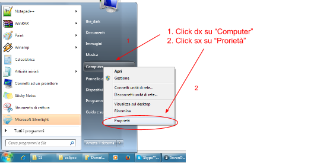
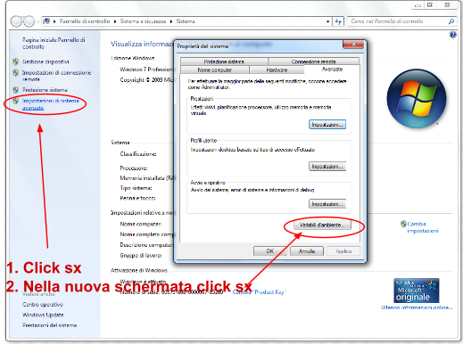
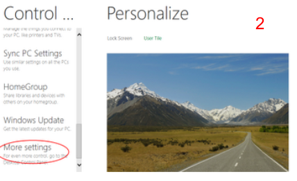
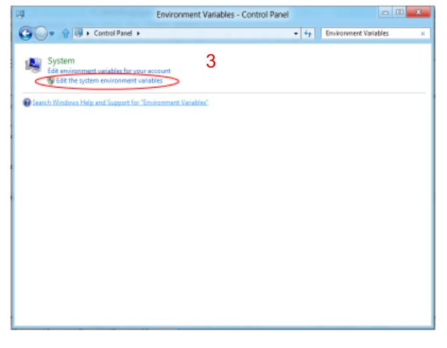

Il seguente documento fornisce le istruzioni necessarie per installare gli strumenti di sviluppo utilizzati nel contesto del corso di Programmazione ad Oggetti. La guida presenta le procedure di installazione su Linux (varie distribuzioni), MacOS X e Windows.

# Java Development Kit (JDK)

Il JDK è l'insieme degli strumenti necessari a sviluppare software standard in Java. Include la virtual machine Java, le librerie Java, di base, il compilatore, e i tool di contorno.

## Linux

In ambiente Linux, la procedura è distro-dependent, ovvero dipendente dal package-manager utilizzato sulla specifica distribuzione. Si riportano qui le istruzioni per le distribuzioni più famose, più diffuse e/o quelle usate dai docenti. Tutte le istruzioni hanno forma di comandi da lanciare nel terminale. Nel caso in cui lo studente utilizzi una diversa distribuzione, si senta libero di contattare i docenti per essere aiutato (va detto che storicamente le richieste sono state zero: chi utilizza una distribuzione poco diffusa di norma sa bene cosa sta facendo).

Al termine del processo di installazione, per verificare la corretta installazione del JDK, è possibile eseguire da shell il comando: ``javac -version``, accertandosi che l’output prodotto sia del tipo: ``javac 1.8.0_<version>``

Per qualsiasi domanda o problematica riscontrata durante l’installazione, rivolgersi direttamente ai tutor del corso.

### Ubuntu e derivate (Linux Mint, elementaryOS...)
Java 8 non è disponibile sui repository ufficiali, ma è fornito tramite PPA.

sudo add-apt-repository ppa:webupd8team/java
sudo apt-get update
sudo apt-get install oracle-java8-installer
sudo apt-get install oracle-java8-set-default


### Arch e derivate (Antergos, Manjaro, Bridge…)
Arch offre il pacchetto OpenJDK 8 direttamente nel repository principale

sudo pacman -S jdk8-openjdk

È possibile avere più ambienti Java installati contemporaneamente, si può selezionare quello corrente utilizzando il comando ``archlinux-java``.

### Debian
Java 8 non è disponibile sui repository ufficiali, ma è fornito tramite PPA.

su -
echo "deb http://ppa.launchpad.net/webupd8team/java/ubuntu trusty main" | tee /etc/apt/sources.list.d/webupd8team-java.list
echo "deb-src http://ppa.launchpad.net/webupd8team/java/ubuntu trusty main" | tee -a /etc/apt/sources.list.d/webupd8team-java.list
apt-key adv --keyserver hkp://keyserver.ubuntu.com:80 --recv-keys EEA14886
apt-get update
apt-get install oracle-java8-installer
exit


### Gentoo e derivate eccetto Sabayon (Calculate, Scientific…)
Gentoo offre il pacchetto JDK 8 via Portage.
Il pacchetto è soggetto a fetch restriction per via della licenza Oracle, dunque come primo passo dovrete scaricare il JDK per Linux dal sito web di Oracle in formato tar.gz, quindi spostare tale archivio in ``/usr/portage/distfiles/``.
A questo punto, lanciare:

su -
emerge --sync
emerge oracle-jdk-bin
eselect java-vm set system oracle-jdk-bin-1.8
exit
eselect java-vm set user oracle-jdk-bin-1.8

È possibile utilizzare contemporaneamente più versioni del JDK, e cambiare quella di default utilizzando il comando `eselect`. In particolare ``eselect java-vm list`` elenca tutte le Java VM installate nel sistema. È possibile configurare la virtual machine di default per-utente e per-sistema.

### Sabayon

su -
equo u
equo i oracle-jdk-bin
eselect java-vm set system oracle-jdk-bin-1.8
exit
eselect java-vm set user oracle-jdk-bin-1.8

Le medesime considerazioni fatte per Gentoo valgono su Sabayon.

### Distro con package manager RPM (Red Hat, Fedora, SUSE, Oracle, SLES)
In generale è possible utilizzare questa procedura per tutte le distribuzioni dotate del package manager RPM. Scaricare il pacchetto di installazione [dal sito Oracle][JDK download page], selezionando il fomato rpm, e la versione Linux x86 oppure Linux x64 a seconda del sistema operativo rispettivamente a 32 o 64 bit.
Tale informazione può essere stampata a video utilizzando il comando `uname -m`. Quindi:

sudo -s
mkdir /opt/Oracle_Java
cd /opt/Oracle_java
rpm -ivh /path/to/package/jdk-8u<version>-linux-x64.rpm
/usr/sbin/alternatives --config java (selezionare l’indice corrispondente a jdk 8)
/usr/sbin/alternatives --config javac (selezionare l’indice corrispondente a jdk 8)
/usr/sbin/alternatives --config jar (selezionare l’indice corrispondente a jdk 8)
exit


## Mac OS X
1. Scaricare il JDK dalla pagina di download ufficiale di Oracle (qui).
2. Eseguire l’eseguibile scaricato e seguire il wizard di installazione passo passo.
3. Verificare la corretta installazione del JDK eseguendo il comando javac da shell.

## Windows

Su Windows la procedura dipende dalla versione utilizzata. In particolare, differisce (a causa di differenze nell'interfaccia grafica) fra Windows 7 e precedenti e Windows 8 e precedenti. Versioni inferiori a Windows Vista non sono supportate.

### Vista / 7

1. Scaricare il JDK dalla [pagina di download ufficiale di Oracle][JDK download page]. Scegliere la versione 32/64 bit corrispondente alla propria versione del sistema operativo (p.e. Windows a 32 bit ---> JDK a 32 bit).
2. Eseguire l’eseguibile scaricato e seguire il wizard di installazione passo passo.
3. Aprire le proprietà di sistema: 

4. Aprire la schermata relativa alle variabili di ambiente: 

5. Configurare la variabile JAVA_HOME come mostrato: 

6. Aggiornare la  variabile d’ambiente PATH come mostrato: 

7. Aprire il prompt dei comandi: 

8. Verificare la corretta installazione del JDK eseguendo il comando `javac` dal prompt dei comandi. L'output atteso è:

Usage: javac <options> <source files>
where possible options include:
  -g                         Generate all debugging info
  -g:none                    Generate no debugging info
  -g:{lines,vars,source}     Generate only some debugging info
  -nowarn                    Generate no warnings
  -verbose                   Output messages about what the compiler is doing
  -deprecation               Output source locations where deprecated APIs are used
  -classpath <path>          Specify where to find user class files and annotation processors
  -cp <path>                 Specify where to find user class files and annotation processors
  -sourcepath <path>         Specify where to find input source files
  -bootclasspath <path>      Override location of bootstrap class files
  -extdirs <dirs>            Override location of installed extensions
  -endorseddirs <dirs>       Override location of endorsed standards path
  -proc:{none,only}          Control whether annotation processing and/or compilation is done.
  -processor <class1>[,<class2>,<class3>...] Names of the annotation processors to run; bypasses default discovery process
  -processorpath <path>      Specify where to find annotation processors
  -parameters                Generate metadata for reflection on method parameters
  -d <directory>             Specify where to place generated class files
  -s <directory>             Specify where to place generated source files
  -h <directory>             Specify where to place generated native header files
  -implicit:{none,class}     Specify whether or not to generate class files for implicitly referenced files
  -encoding <encoding>       Specify character encoding used by source files
  -source <release>          Provide source compatibility with specified release
  -target <release>          Generate class files for specific VM version
  -profile <profile>         Check that API used is available in the specified profile
  -version                   Version information
  -help                      Print a synopsis of standard options
  -Akey[=value]              Options to pass to annotation processors
  -X                         Print a synopsis of nonstandard options
  -J<flag>                   Pass <flag> directly to the runtime system
  -Werror                    Terminate compilation if warnings occur
  @<filename>                Read options and filenames from file


### Windows 8
1. Seguire i punti 1 e 2 della guida per Windows 7

2. Aprire le proprietà di sistema:  
  
  

3. Seguire i punti 4, 5, e 6 della guida a per Windows 7

4. Muovere il mouse verso l'angolo in alto a destra dello schermo.

5. Nel menu che apparirà, scegliere la ricerca, quindi scorrere il menu verso destra - inizialmente la parte destra potrebbe essere nascosta.

6. A questo punto, dovrebbe comparire il prompt dei comandi fra le applicazioni avviabili.

7. Eseguire il punto 8 delle istruzioni per Windows 7.

# Eclipse

### Arch Linux e derivate (Manjaro, Antergos, Bridge...)
Arch è l’unica distribuzione che manutiene nel repository ufficiale Eclipse all’ultima versione, sempre aggiornato. Gli utenti di Arch possono usare il package manager per installare Eclipse (``sudo pacman -S eclipse``), e saltare direttamente al punto 6, lanciando il comando ``eclipse``.

## Tutti i sistemi operativi
1. Scaricare “Eclipse IDE for Java Developers” (ultima versione disponibile) dalla [pagina di download ufficiale (qui)][Eclipse Download]. Scegliere la versione 32/64 bit corrispondente alla propria versione del JDK (normalmente 64bit).
2. Decomprimere il file scaricato utilizzando il programma di gestione degli archivi che siete abituati ad utilizzare (FileRoller, Ark, 7zip...).
3. Al termine della procedura dovrebbe essere presente la cartella “eclipse”.
4. Per utenti Windows e MacOS X: All’interno della cartella dovrebbe essere presente il file di configurazione “eclipse.ini”: aprire il file con un editor di testo e aggiungere in fondo la seguente riga: ``-Dfile.encoding=UTF8``. Gli utenti Linux hanno UTF-8 settato di default.
5. Aprire la cartella e lanciare l’IDE facendo doppio click sul file eseguibile contenuto nella cartella.
6. Se l’installazione è andata a buon fine si dovrebbe aprire il welcome screen dell'IDE.

### Risolvere bug Eclipse / GTK+3 su Linux
Eclipse ha attualmente [Un bug noto](https://bugs.eclipse.org/bugs/show_bug.cgi?id=354842) che rende l'interfaccia poco reattiva ed aumenta l'uso della CPU da parte dell'IDE, rendendolo praticamente inusabile.
Tale bug è dovuto al modo in cui SWT (la libreria grafica usata da Eclipse) si interfaccia con GTK+3. Il bug si presenta solo in alcune combinazioni di Eclipse / GTK+3.
Onde evitare qualunque problema di questo tipo, il suggerimento è quello di utilizzare GTK+2.
Per farlo, si utilizzi uno dei seguenti modi:

* Se l'installazione è stata eseguita da package manager, si utilizzi il comando `which eclipse` per individuare la posizione del file eseguibile rappresentante Eclipse (normalmente è `/usr/bin/eclipse`). Il file dovrebbe essere uno script sh, che può essere editato. Si esegua `sudo <EDITOR> <PERCORSO>`, sostituendo a `<EDITOR>` il nome del vostro editor di testi preferito (ad esempio, `nano`) e a `<PERCORSO>` il percorso effettivo del file (ad esempio `/usr/bin/eclipse`). Il file che si apre dovrebbe avere il seguente aspetto:

#!/bin/bash
export ECLIPSE_HOME=/usr/lib/eclipse
exec ${ECLIPSE_HOME}/eclipse "$@"

Lo si modifichi in modo che diventi:

#!/bin/bash
export ECLIPSE_HOME=/usr/lib/eclipse
export SWT_GTK3=0
exec ${ECLIPSE_HOME}/eclipse "$@"

Si salvi il file. Le nuove istanze di Eclipse utilizzeranno GTK+2.

* Se l'installazione è stata fatta manualmente, scaricando il pacchetto dal sito di Eclipse, si individui il file `eclipse.ini` nella cartella di installazione. Lo si apra con un editor di testo. Il file dovrebbe apparire simile a:

-startup
plugins/org.eclipse.equinox.launcher_1.3.100.v20150511-1540.jar
--launcher.library
plugins/org.eclipse.equinox.launcher.gtk.linux.x86_64_1.1.300.v20150602-1417
-product
org.eclipse.epp.package.java.product
--launcher.defaultAction
openFile
-showsplash
org.eclipse.platform
--launcher.XXMaxPermSize
256m
--launcher.defaultAction
openFile
--launcher.appendVmargs                                                                                                                                                                                             
-vmargs                                                                                                                                                                                                             
-Dosgi.requiredJavaVersion=1.7                                                                                                                                                                                      
-XX:MaxPermSize=256m                                                                                                                                                                                                
-Xms256m
-Xmx1024m

Si aggiunga alle opzioni, **prima** di `-vmargs`, la seguente opzione:
``
--launcher.GTK_version
2
``
In modo che il file diventi:

-startup
plugins/org.eclipse.equinox.launcher_1.3.100.v20150511-1540.jar
--launcher.library
plugins/org.eclipse.equinox.launcher.gtk.linux.x86_64_1.1.300.v20150602-1417
-product
org.eclipse.epp.package.java.product
--launcher.defaultAction
openFile
-showsplash
org.eclipse.platform
--launcher.XXMaxPermSize
256m
--launcher.defaultAction
openFile
--launcher.appendVmargs
--launcher.GTK_version
2
-vmargs                                                                                                                                                                                                             
-Dosgi.requiredJavaVersion=1.7                                                                                                                                                                                      
-XX:MaxPermSize=256m                                                                                                                                                                                                
-Xms256m
-Xmx1024m


# Plugin di Eclipse

Eclipse utilizza un'architettura a plug-in. Lungo il corso ne utilizzeremo alcuni che ci forniranno funzionalità aggiuntive.

## FindBugs
* In Eclipse, click Help -> Eclipse Marketplace...
* Nella barra di ricerca, inserire "findbugs", quindi premere Invio
* Uno dei plugin trovati dovrebbe essere "FindBugs Eclipse Plugin", clickare su Install
* Seguire le istruzioni, accettare la licenza, attendere che Eclipse scarichi ed installi il prodotti, accettare l'installazione e riavviare l'IDE.

## PMD
* **NON** installare eclipse-pmd da Eclipse Marketplace
* In Eclipse, click Help -> Install New Software
* Nel campo di testo con etichetta "Work with:", scrivere: https://sourceforge.net/projects/pmd/files/pmd-eclipse/update-site-latest/
* Premere Invio
* PMD for Eclipse 4 apparirà nella lista dei plugin. Selezionatelo e clickate Next.
* Seguire le istruzioni, accettare la licenza, attendere che Eclipse scarichi ed installi il prodotti, accettare l'installazione e riavviare l'IDE.

## Checkstyle
* In Eclipse, click Help -> Eclipse Marketplace...
* Nella barra di ricerca, inserire "checkstyle", quindi premere Invio
* Uno dei plugin trovati dovrebbe essere "Checkstyle Plug-in", clickare su Install
* Seguire le istruzioni, accettare la licenza, attendere che Eclipse scarichi ed installi il prodotti, accettare l'installazione e riavviare l'IDE.

## MercurialEclipse (HGE)
* Installare **prima** di seguire questa guida Mercurial nel proprio OS ed assicurarsi che funzioni correttamente (si veda la prossima sezione di questo documento)
* In Eclipse, click Help -> Eclipse Marketplace...
* Nella barra di ricerca, inserire "hge", quindi premere Invio
* Uno dei plugin trovati dovrebbe essere "MercurialEclipse", con un'icona argento. Clickare su Install
* Seguire le istruzioni, accettare la licenza, attendere che Eclipse scarichi ed installi il prodotti, accettare l'installazione e riavviare l'IDE.

# Mercurial

Mercurial è un decentralized version control system (DVCS), che consente di tenere traccia della storia di un progetto, versionarla, tornare allo stato precedente, e lavorare in parallelo.

Al termine del processo di installazione, per verificare la corretta installazione dei Mercurial JDK, è possibile eseguire da shell il comando: ``hg``, accertandosi che l’output prodotto sia del tipo:

Mercurial Distributed SCM

basic commands:

 add           add the specified files on the next commit
 annotate      show changeset information by line for each file
 clone         make a copy of an existing repository
 commit        commit the specified files or all outstanding changes
 diff          diff repository (or selected files)
 export        dump the header and diffs for one or more changesets
 forget        forget the specified files on the next commit
 init          create a new repository in the given directory
 log           show revision history of entire repository or files
 merge         merge another revision into working directory
 pull          pull changes from the specified source
 push          push changes to the specified destination
 qdiff         diff of the current patch and subsequent modifications
 qnew          create a new patch
 qpop          pop the current patch off the stack
 qpush         push the next patch onto the stack
 qrefresh      update the current patch
 remove        remove the specified files on the next commit
 serve         start stand-alone webserver
 status        show changed files in the working directory
 summary       summarize working directory state
 update        update working directory (or switch revisions)

(use "hg help" for the full list of commands or "hg -v" for details)


## Linux

Come per altri softare, la procedura è distro-dependent.

Per qualsiasi domanda o problema riscontrato durante l’installazione, rivolgersi direttamente ai tutor del corso.

### Debian, Ubuntu e derivate (Linux Mint, elementaryOS...)
Mercurial è disponibile sui repository ufficiali.

sudo apt-get update
sudo apt-get install mercurial


### Arch e derivate (Antergos, Manjaro, Bridge…)
Mercurial è disponibile nel repository ``extra``

sudo pacman -S mercurial


### Gentoo e derivate eccetto Sabayon (Calculate, Scientific…)

su -
emerge --sync
emerge mercurial
exit


### Sabayon

su -
equo u
equo i mercurial
exit


### Distro con package manager RPM (Red Hat, Fedora, SUSE, Oracle, SLES)

sudo yum install mercurial


## Mac OS X
Visitare il [sito web di Selenic][Mercurial download page], scaricare a mano il pacchetto installabile per Mac, eseguirlo e seguire le istruzioni.

## Windows
Visitare il [sito web di Selenic][Mercurial download page], scaricare a mano il pacchetto compatibile col proprio sistema operativo e seguire le istruzioni per l'installazione.
Una volta installato, bisognerà modificare il path per far sì che Windows sia in grado di trovare ``hg.exe`` fra gli eseguibili.
Si proceda come segue:

1. Identificare la cartella dove si trova il file ``hg.exe``. Normalmente, viene installato in ``C:\Windows\Programmi\Mercurial``. Ci si annoti il percorso, che d'ora in poi chiameremo ``<PATH_MERCURIAL>``.

2. Utilizzando la medesima procedura illustrata per l'installazione del JDK, si modifichi la variabile di sistema ``PATH`` **aggiungendo** alla stringa già esistente ``;<PATH_MERCURIAL>`` dove a ``<PATH_MERCURIAL>`` va sostituito il percorso che avete identificato al punto precedente.

3. Si chiudano eventuali prompt dei comandi aperti, si apra un nuovo prompt dei comandi, e si testi il corretto funzionamento del comando ``hg``.

# Git

## GIT per Windows
1. Scaricare “GIT for Windows” (nella versione specifica per la propria architettura x86 o x64) dalla [pagina di download ufficiale (qui)][GIT-Windows Download].
2. Eseguire il programma di installazione
    * Accettare la licenza > Next > Next
    * (IMPORTANTE) Selezione "Use Git from the Windows Command Prompt" > Next
    * Accettare le successive opzioni proposte dall'installer > Install > Finish
3. Verificare la corretta installazione
    * Aprire il prompt dei comandi (cmd.exe)
    * Se il tool è stato installato correttamente, digitando il comando "git" apparirà il classico help

## GIT per Mac OS X
1. Scaricare l'installer di Git per OS X dalla [pagina di download ufficiale][GIT-OSX Download]
2. Eseguire il programma per l'installazione
    * Eventualmente, eseguire l'installer anche se non sviluppato da una fonte identificata da Apple Store (vedi System preferences > Security > General)
    * Continue > Install
3. Verificare la correttezza dell'installazione
    * Aprire una shell
    * Eseguire il comando "git": se l'installazione è andata a buon fine, apparirà il menu di help per il comando

[JDK download page]: http://www.oracle.com/technetwork/java/javase/downloads/jdk8-downloads-2133151.html
[Mercurial download page]: https://www.mercurial-scm.org/downloads
[Eclipse Download]: https://www.eclipse.org/downloads/
[GIT-Windows Download]: https://git-for-windows.github.io/
[GIT-OSX Download]: http://git-scm.com/download/mac
